# libasm

## Mandatory

### ft_strlen

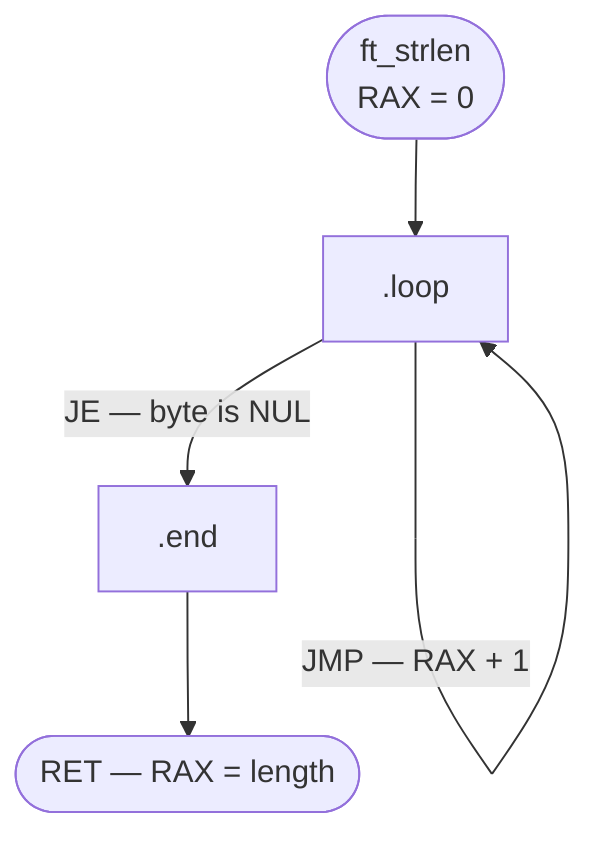

### ft_strcpy

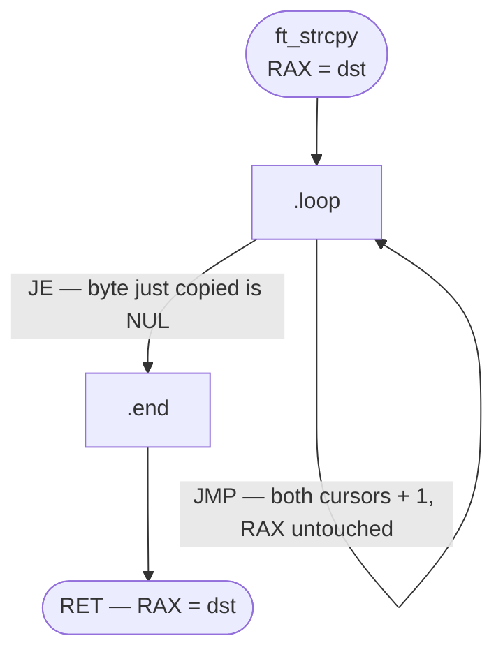

### ft_strcmp

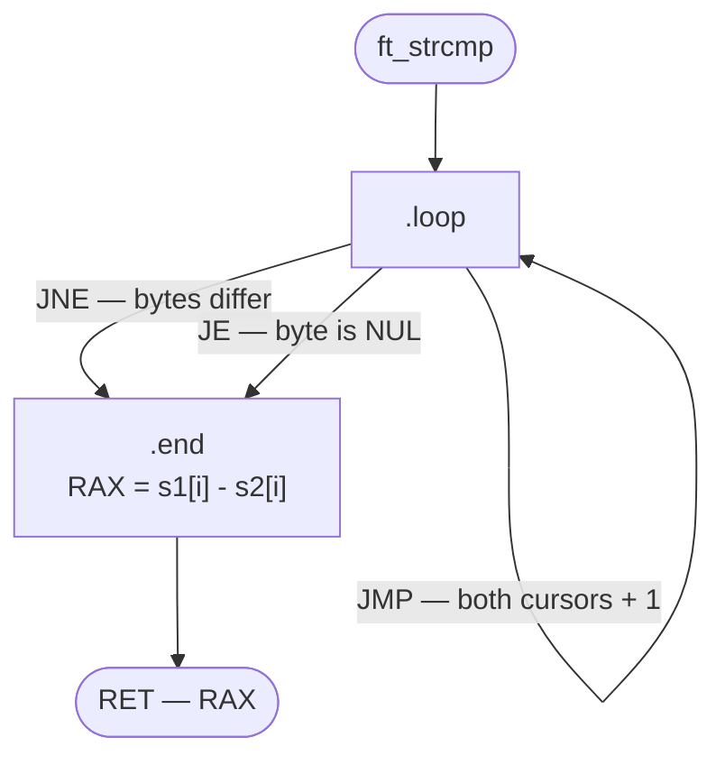

### ft_write / ft_read

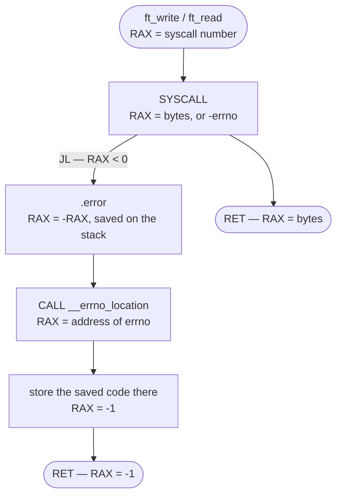

### ft_strdup

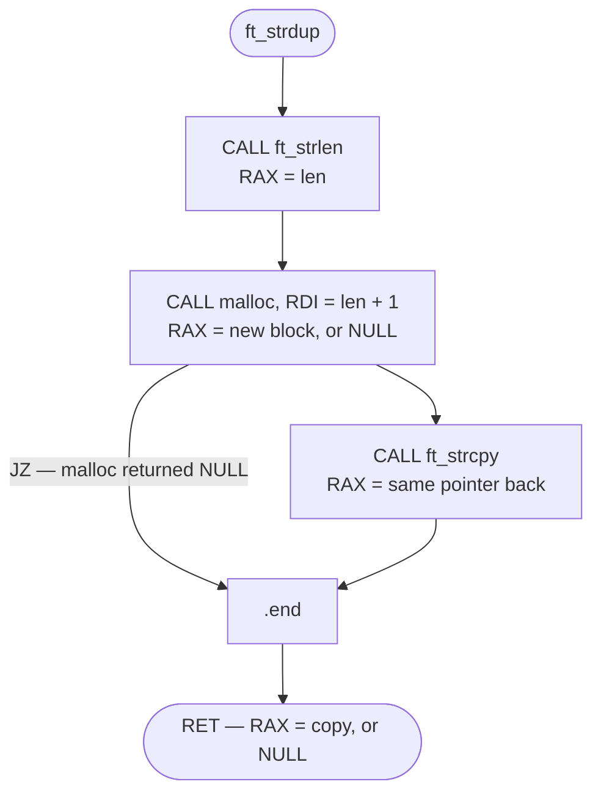

## Bonus

### ft_atoi_base

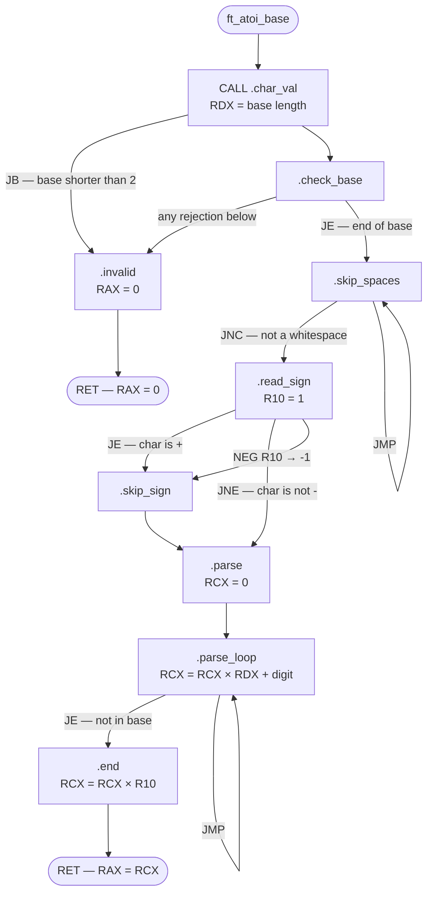

#### .check_base

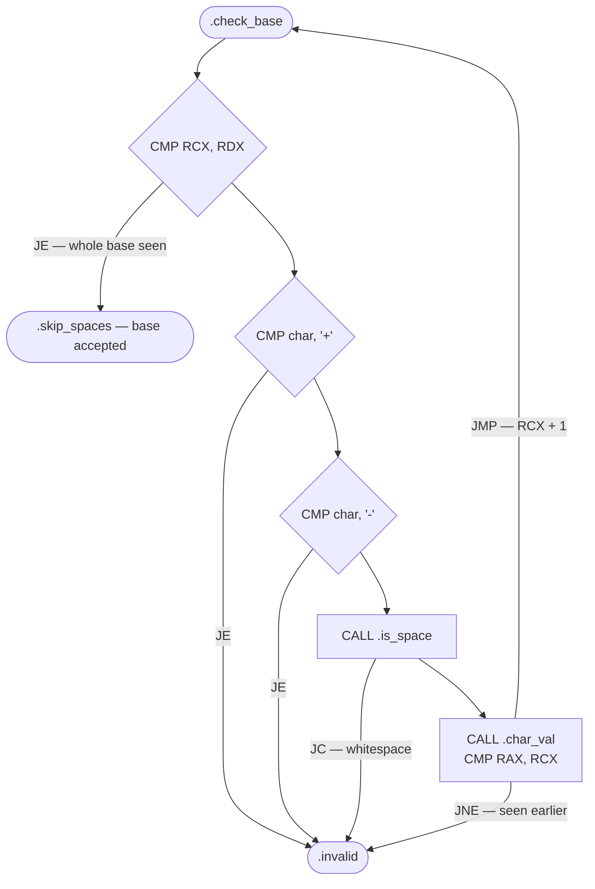

#### .char_val

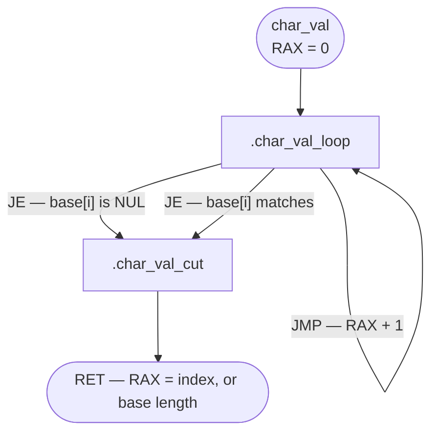

#### .is_space

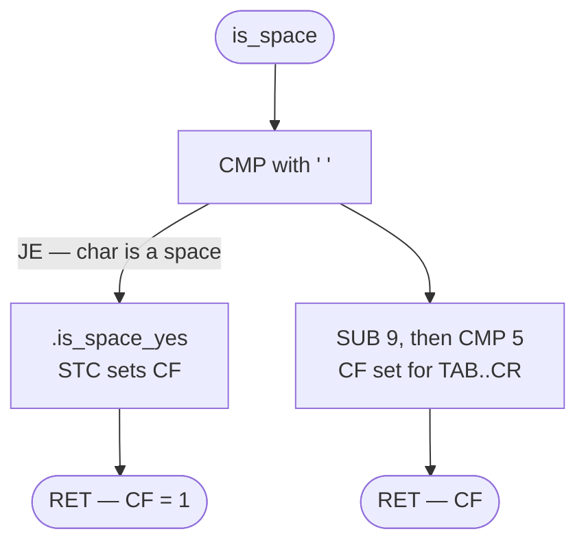

### ft_list_size

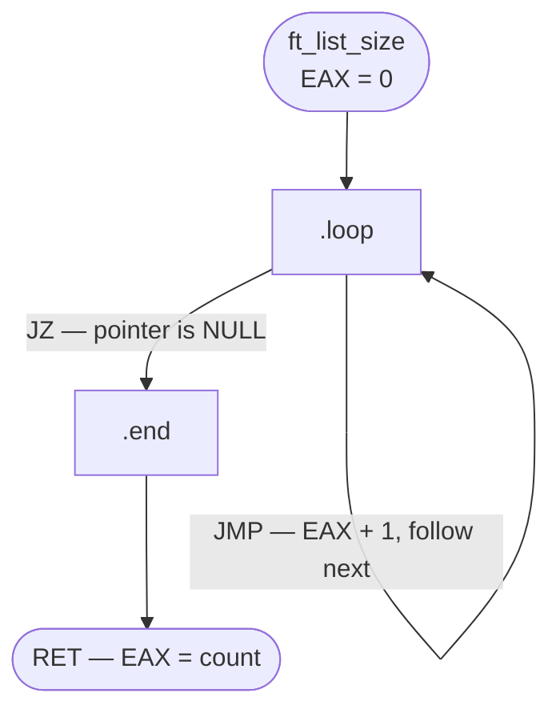

### ft_list_push_front

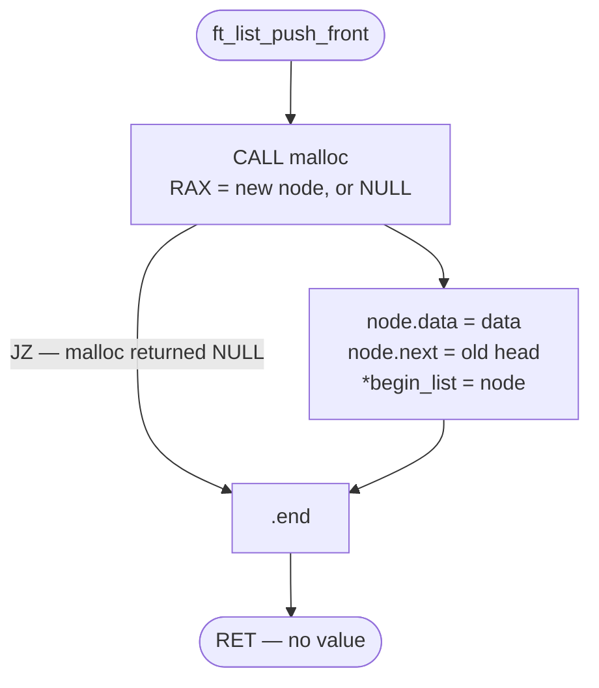
